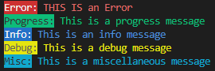

# OnRailsLogger

Welcome to OnRailsLogger a simple logging application which can fit right into your codebase. OnRails features total of 6 different log types, and 6 different logging levels. The application is simple requiring one initialization step at your codes entrypoint and then just report your error.

**This is a simple logger, it has a synchronized block around the main logging method. This is the only thread safety included. No guarantees are given through locks/queues/semaphores.**

Logs can be found in your user.home directory under OnRailsLogging and then your application name.

## Quick notes

The logger is still in development. Simple things you may expect to exist may not at this point. They will come soon, checkout the roadmap at the bottom which details the next features to come.

## Adding the logger to a maven project
The logger uses JitPack to package and install the project. Paste the code found below into your pom.xml. **Check tags for releases, not all changes in main are in the current release VERSION: `v1.0.0`**. Second release coming after testing infrastructure fully implemented.

```xml
<dependencies>
	<dependency>
	    <groupId>com.github.rhys-h-walker</groupId>
	    <artifactId>OnRailsLogging</artifactId>
	    <version>Tag</version>
	</dependency>
<dependencies>

<repositories>
	<repository>
		<id>jitpack.io</id>
		<url>https://jitpack.io</url>
	</repository>
</repositories>
```

For additional instructions on how to install check out the jitpack page for the repo - [here](https://jitpack.io/#rhys-h-walker/OnRailsLogging).

## How to use

Before using the Logger there are two things to understand. You have the power to log to a file and console or just console. When logging to just console add true to the final argument of initializeLogger. Logging visibility can be customized through a HashMap<LoggingType, boolean> this is the second argument in the second initializer. There are three available by default, check LoggingType for the methods.

Make sure to call initialize Logger before doing anything else, otherwise no logs will be shown.

```Java
Logger.initializeLogger("applicationName", false);

// Or

Logger.initializeLogger("applicationName", LoggingType.defaultVisibility(), false);

// Then

Logger.logerror("This is an Error message");
Logger.logprogress("This is a progress message");
Logger.loginfo("This is an info message");
Logger.logwarn("This is a warning message");
Logger.logdebug("This is a debug message");
Logger.logmiscellaneous("This is a miscellaneous message");
```

The output file will look like this:
```
[2025-07-14-23:15:16] ERROR: This is an an Error message
[2025-07-14-23:15:16] PROGRESS: This is a progress message
[2025-07-14-23:15:16] INFO: This is an info message
[2025-07-14-23:15:16] WARN: This is an warning message
[2025-07-14-23:15:16] DEBUG: This is a debug message
[2025-07-14-23:15:16] MISCELLANEOUS: This is a miscellaneous message
```

When printing to console the outputs have colours like so: <br>


## Recent updates
- Allow for logging to be more fine grained with level
	- This will allow for the silencing of certain logging messages,
- Basic thread safety, synchronized block in produceLog
- Error handling for most cases
- Testing for basic console output
- Error handling in file-creation/string creation
- Handle null messages with a message when printing/writing

## Roadmap

Updates are located in three groups, Next is what I am currently working on, soon will be after that and future has no specific date or timeframe attached to it.

### Next
- Testing via Junit
	- Core:
		- File writing
		- File location/creation
		- Directory structure creation
		- File content verification
		- File rotation behaviour
	- Configuration
		- ChangeVisibility
		- ViewLogVisibility
		- GetApplicationName
		- Default visibility settings
		- Custom visibility maps
	- Error handling
		- Permission denied scenarios
		- Null configuration handling
		- Null configuration handling
		- System property access failures
		- Security exceptions
		- LogFactory initialization failures
		- PrintWriter creation failures
		- File locking Scenarios
	- Thread safety
		- Potentially will remain untested
	- Cross-platform testing
		- Potentially may remain untested
		- Path characters on (Windows/Unix/Mac)
		- Case sensitivity (Platform dependent)
		- Unicode characters
		- Path length limits
	- File system operations
		- Shutdown hook execution
	- LogFactory
		- isInitialized status checking
		- Constructor error handling
		- PrintWriter recreation, for timestamps
		- ErrorFlag management
	- Input validation
		- Empty application names
		- Null logging type handling
	- Integration Testing
		- End-to-end workflow, init->log->verify
		- File+console dual output verification
		- Console only mode
		- Fallback behaviour chains

### Soon
- Configuration file support:
	- Reading of a simple `.properties` file, this will allow things like, custom location routing. Default custom settings.
- Log file limits, max size to these files. (Some change to directory structure needed)
- Log deletion, setup a default timeframe for logs to be deleted, checked on initialization of the application. And also routinely when some other function is called:
	- In the future will allow customisation of the features.
- Execption logging, a nice and clean method of logging exception methods.
- Application name validator

### Future
- Create a wiki
- Make a Log viewer.
	1. A standalone application that can view all logs for a certain application
	2. A FXML component which can be added to a project to view logs:
		- This is an embedable component
		- Can be added anywhere and will just view logs for the app
- Custom log formats (Allow adjustment of certain features based on user requirements)
- Reinitialization of the Logger, recovery from a crash if told to be user

## Examples

OnRailsLogger is new and there are few examples, however I have converted one of my old projects over to use it, you can find it [here](https://github.com/rhys-h-walker/rambling-jesters/tree/adding-on-rails-logging).

Please if you use this project contact me so I can place your project on examples.
