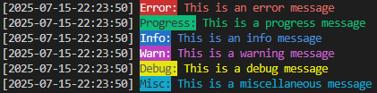

# OnRailsLogger

Welcome to OnRailsLogger a simple logging application which can fit right into your codebase. OnRails features total of 6 different log types, and 6 different logging levels. The application is simple requiring one initialization step at your codes entrypoint and then just report your error.

**This is a simple logger, it has a synchronized block around the main logging method. This is the only thread safety included. No guarantees are given through locks/queues/semaphores.**

Logs can be found in your user.home directory under OnRailsLogging and then your application name.

## Quick notes

The logger is still in development. Simple things you may expect to exist may not at this point. They will come soon, checkout the roadmap at the bottom which details the next features to come.

## Adding the logger to a maven project
The logger uses JitPack to package and install the project. Paste the code found below into your pom.xml. **Check tags for releases, not all changes in main are in the current release VERSION: `v1.0.0`**

```xml
<dependencies>
	<dependency>
	    <groupId>com.github.rhys-h-walker</groupId>
	    <artifactId>OnRailsLogging</artifactId>
	    <version>Tag</version>
	</dependency>
<dependencies>

<repositories>
	<repository>
		<id>jitpack.io</id>
		<url>https://jitpack.io</url>
	</repository>
</repositories>
```

For additional instructions on how to install check out the jitpack page for the repo - [here](https://jitpack.io/#rhys-h-walker/OnRailsLogging).

## How to use

To use the logger you must first decide how you wish it to work. Currently there are three options:
- Console reporting
- Logging to file
- Both of the above

To just log to a console ignore the initialization step. To just output to file set LoggingLevel.NONE in initialization.

```Java
Logger.initializeLogger("applicationName");

// Or

Logger.initializeLogger("applicationName", LoggingLevel.ALL);

// Then

Logger.logerror("This is an Error message");
Logger.logprogress("This is a progress message");
Logger.loginfo("This is an info message");
Logger.logwarn("This is a warning message");
Logger.logdebug("This is a debug message");
Logger.logmiscellaneous("This is a miscellaneous message");
```

The output file will look like this:
```
[2025-07-14-23:15:16] ERROR: This is an an Error message
[2025-07-14-23:15:16] PROGRESS: This is a progress message
[2025-07-14-23:15:16] INFO: This is an info message
[2025-07-14-23:15:16] WARN: This is an warning message
[2025-07-14-23:15:16] DEBUG: This is a debug message
[2025-07-14-23:15:16] MISCELLANEOUS: This is a miscellaneous message
```

When printing to console the outputs have colours like so: <br>


## Recent updates
- Allow for logging to be more fine grained with level
	- This will allow for the silencing of certain logging messages,
- Basic thread safety, synchronized block in produceLog

## Roadmap

Updates are located in three groups, Next is what I am currently working on, soon will be after that and future has no specific date or timeframe attached to it.

### Next
- Add Junit tests for console output
- Error handling in file-creation/string creation
- Handle null messages with a message when printing/writing

### Soon
- Configuration file support:
	- Reading of a simple `.properties` file, this will allow things like, custom location routing. Default custom settings.
- Log file limits, max size to these files. (Some change to directory structure needed)
- Log deletion, setup a default timeframe for logs to be deleted, checked on initialization of the application. And also routinely when some other function is called:
	- In the future will allow customisation of the features.
- Execption logging, a nice and clean method of logging exception methods.

### Future
- Create a wiki
- Make a Log viewer.
	1. A standalone application that can view all logs for a certain application
	2. A FXML component which can be added to a project to view logs:
		- This is an embedable component
		- Can be added anywhere and will just view logs for the app
- Custom log formats (Allow adjustment of certain features based on user requirements)

## Examples

OnRailsLogger is new and there are few examples, however I have converted one of my old projects over to use it, you can find it [here](https://github.com/rhys-h-walker/rambling-jesters/tree/adding-on-rails-logging).

Please if you use this project contact me so I can place your project on examples.
